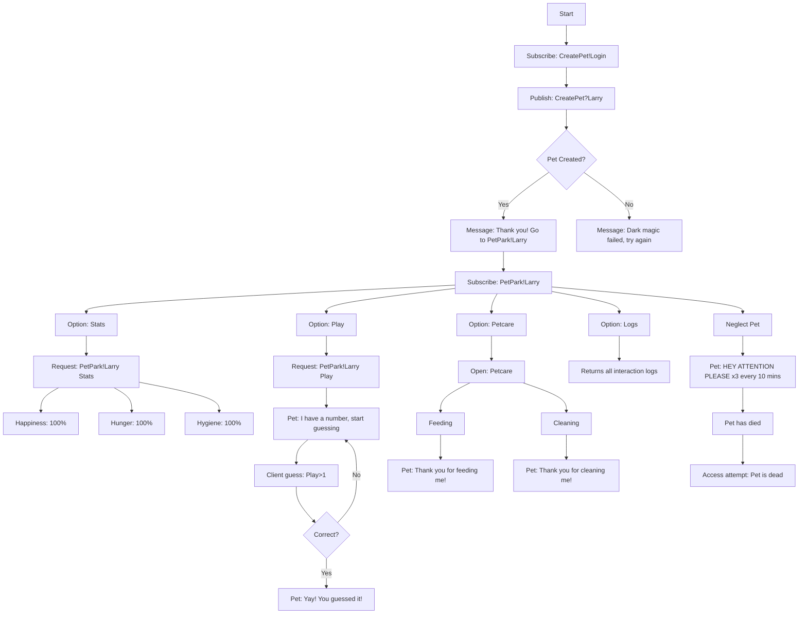

# Networkprogramming Benternetassignment Tamagotchiland Project
 


## About the project

What I hope to achieve with this project is to make a **Tamagotchiland** that works on the Benternet. When the user logs in they can name their pet and the game will start. Not all features will currently work of the Tamagotchi since each one can differs a lot in functionality. That is why the focus will be on the most basic features. Hunger levels, happiness levels, hygiene levels and a minigame. After some time has passed and the Tamagotchi is not fed, cleaned or happy enough it will remind the user 3 times. When that hasn't happend the animal will say goodbye and **die**. To entertain the Tamagotchi the user will be able to play a numbergame this will raise their happiness level since they love guessing :).

**Sequence of operation**:

1. The client subscribe to ``Tamagotchiland>CreatePet!>Login``.

2. There the client will publish the following for now the name of the pet will be ``Tamagotchiland>CreatePet?>Larry``.

3. To confirm that the pet is created the user will see the following:

   1. When it happens correctly
      1. ``Hi thank you for creating me! To play with me go to Tamagotchiland>PetPark!>Larry ``

   2. When it happens incorrectly
      1. ``Oh no it seems that the dark magic hasn't worked please try again``

4. Now the client will subscribe and be brought to the **PetPark** here the client will be able to interact with their pet. These are the options:

   1. Stats: By using ``Tamagotchiland>PetPark!>Larry>Stats`` the client will be able to see their pets stats like this:

      1. ``Tamagotchiland>PetPark?>Larry>Stats>Happiness>100%``

      2. ``Tamagotchiland>PetPark?>Larry>Stats>Hunger>100%"`

      3. ``Tamagotchiland>PetPark?>Larry>Stats>Hygiene>100%``

         

   2. Play: by using ``Tamagotchiland>PetPark!>Larry>Play`` a number guessing game will start like this:

      

      1. ``Tamagotchiland>PetPark?>Larry>Play: Okay I have a number start guessing``

         1. To which the client will start guessing between 0 and 10: the player can guess like this:

            1. ``Tamagotchiland>PetPark!>Larry>Play>1``

         2. The pet will respond accordingly with either "Y" or "N" until the number is guessed.

            

   3. The option is Petcare which can be accessed like this:

      

      1. ``Tamagotchiland>PetPark!>Larry>Petcare``

         1. To feed the pet the client sends ``Tamagotchiland>PetPark!>Larry>Petcare>Feeding``
         2. To clean the pet the client sends ``Tamagotchiland>PetPark!>Larry>Petcare``

         

      2. The pet will then respond with ``Tamagotchiland>PetPark!>Larry>Petcare>Thank you for cleaning me!`` or ``Tamagotchiland>PetPark!>Larry>Petcare> "Thank you for Feeding me!"``.

         

   4. When the pet is not kept properly it will say "HEY ATTENTION PLEASE" which will repeat 3 times with a delay of 10 minutes between each calls until the Pet passes away. Trying to access the pet will not work and say The pet has died.

   5. Finally there is the option for logs ``Tamagotchiland>PetPark!>Larry>Logs``. By doing this it will give the user a log of all interactions.

      


## Logic flowchart **to be updated moet van netwerklogica zijn**



## Getting Started

To run the project, follow these steps:

1. **Clone the Repository**:
   ```bash
   git clone https://github.com/SamyWarnants/Networkprogramming-Benternetopdracht.git
   ```
2. **Create an account on [Qt group](https://www.qt.io/download-dev) and download the following packages:**
   
   - (For Windows it is setup like this):
     
3. **Now you can go to the project folder and open the project inside of it.**:
4. **Now you can run the game! Congratulations!! (It can be that the terminal won't let you have input to fix this go to projects=>Run=> and enable run in terminal.**


## People

- **Samy Warnants** - __Student__ - [SamyWarnants](https://github.com/SamyWarnants)

  
